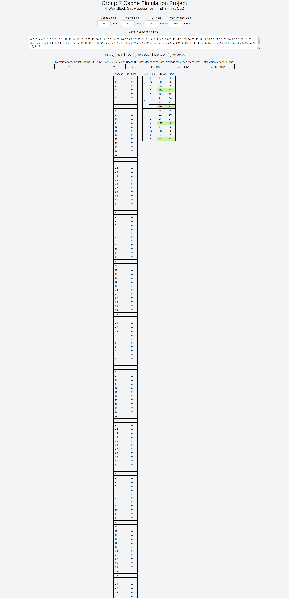
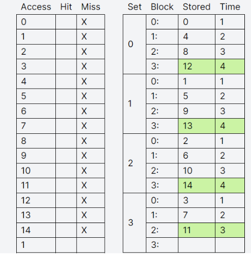
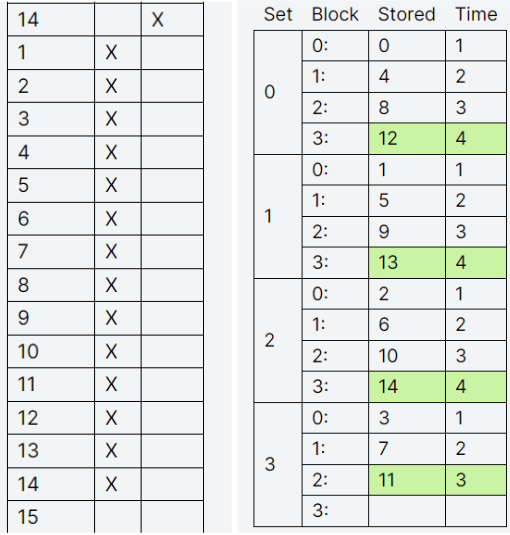
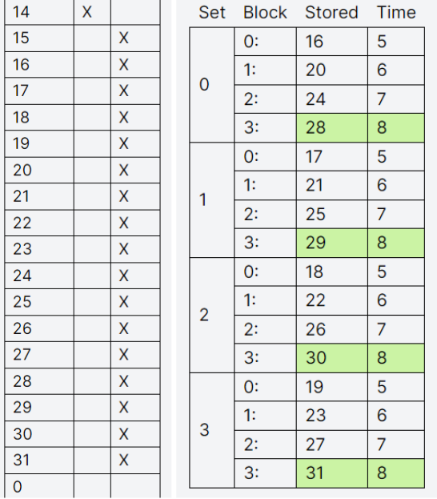
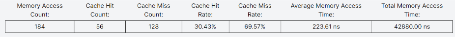

# CSARCH2-Cache-Simulation
[Test Case A](#test-case-a)

[Test Case B](#test-case-b)

[Test Case C](#test-case-c)

# Test Case A
For our cache type, the test case has a 100% cache miss

If the Set Size >= 2n cache blocks, the 1st loop over the cache blocks will always be a miss, but the next 3 loops will always be a cache hit. Otherwise, there is a 100% miss rate if the Set size < 2n cache block. The reason for this is if the case of the Set size being larger or equal to 2n cache block, there is enough space to load all sequential memory blocks to the cache, so the next following loops after the first loop will always be a cache hit. If the Set size is smaller then there won’t be enough space for all memory blocks, so the remaining memory blocks to be transferred in the first loop will replace the positions of the memory blocks in the cache that were placed first (FIFO) which continues all throughout the loop, resulting to a 100% cache miss.

# Test Case B

# Test Case C

Because of this test case's specifications requiring a 2n of cache blocks with a constant cache size of 16 blocks, memory size should be set to 32 or higher.
[16] cache blocks, [32] words per cache block, [4] blocks per set, [32] main memory blocks

Starting at block 0, the first iteration of the sequence up until the n-1(14) cache block are cache misses, amounting up to n-1*(32*10+1)ns or 4815ns memory access time.
*n is the number of cache blocks

When the sequence repeats cache block 1 to the n-1(14) cache block, they are all cache hits (cache remains unchanged) as all memory blocks of the first iteration was still inside cache, amounting up to (n-1-1)*(32)ns or 448ns memory access time. [block 0 is not included in the second iteration]

Memory sequence then increments until the 2n cache block which are also cache misses, amounting up to n+1*(32*10+1)ns or 5457ns memory access time.

The entire sequence is then repeated 4 times, wherein cache from the previous sequence iteration does not cause any cache hits. resulting in a final memory access time of 4*(4815+448+5457)ns or 42880ns. Each sequence iteration having 14 cache hits and 32 cache misses.

